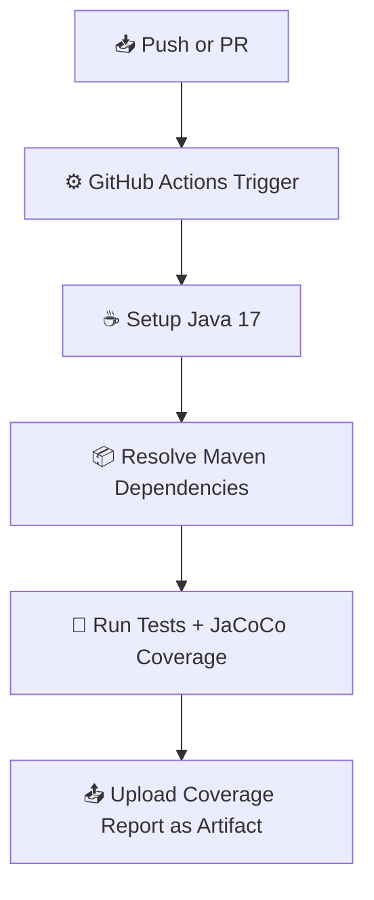

# 📦 Orders Calculator - Agile Testing Demo

<div align="center">

[](https://openjdk.org/projects/jdk/17/)
[](https://maven.apache.org/)
[](https://junit.org/junit5/)
[](LICENSE)

[](https://github.com/gperzal/orders-calculator/actions)

</div>

---

## 📋 Description

**Orders Calculator** is a simple Java project developed to practice **Agile Testing principles** and **CI/CD integration**. It simulates the logic behind calculating orders and applying conditional discounts using a test-driven approach.

🎯 **Main Objective:**  
To ensure discount rules are correctly applied depending on business logic, supported by unit and mock-based testing.

---

## 🛠️ Technologies Used

| Tool        | Version | Purpose                      |
|-------------|---------|------------------------------|
| ☕ Java      | 17      | Main programming language     |
| 📦 Maven    | 3.8+    | Build and dependency manager  |
| 🧪 JUnit 5  | 5.10    | Unit testing framework        |
| 🎭 Mockito   | 5.12    | Mocking framework for tests   |
| 🧮 JaCoCo   | 0.8.11  | Code coverage analysis        |
| 🔄 GitHub Actions | —   | Continuous Integration (CI/CD) |

---

## 🧩 Project Structure

```
orders-calculator/
│
├── 📁 src/
│   ├── 📁 main/java/cl/devops/
│   │   ├── OrderService.java          # Core logic for processing orders
│   │   └── DiscountRepository.java    # Simulated repository for discounts
│   └── 📁 test/java/cl/devops/
│       ├── OrderServiceTest.java          # Pure unit tests
│       └── OrderServiceMockTest.java      # Tests using Mockito
│
├── 📄 pom.xml                          # Project configuration
└── 📁 .github/workflows/
    └── java.yml                       # CI/CD workflow
```

---

## 🚀 Agile Testing Principles in Action

<table>
<tr>
<td>✅</td>
<td><strong>Test Automation</strong><br>All business logic is covered by JUnit tests with mock support via Mockito.</td>
</tr>
<tr>
<td>⚡</td>
<td><strong>Fast Feedback</strong><br>Tests run automatically on every push or PR using GitHub Actions.</td>
</tr>
<tr>
<td>🔍</td>
<td><strong>Code Quality</strong><br>JaCoCo ensures coverage metrics are collected and reviewed.</td>
</tr>
<tr>
<td>📈</td>
<td><strong>Continuous Validation</strong><br>CI workflow prevents regressions and ensures working code at all times.</td>
</tr>
</table>

---

## 🧪 How to Run Tests Locally

### 1️⃣ Clone the repository
```bash
git clone https://github.com/gperzal/orders-calculator.git
cd orders-calculator
```

### 2️⃣ Run tests with Maven
```bash
mvn clean test
```

### 3️⃣ Generate coverage report (JaCoCo)
```bash
mvn clean verify
# Open the report in:
# target/site/jacoco/index.html
```

---

## 🔄 CI/CD with GitHub Actions

This project uses GitHub Actions to automate testing and coverage reporting:



✅ The CI workflow is defined in `.github/workflows/orders-calculator.yml` and includes:
- Java setup via Temurin
- Caching Maven dependencies
- Running unit and mock-based tests
- Uploading coverage report

---

## 🧠 Contributions

We welcome contributions! Follow these steps:

| Step | Action |
|------|--------|
| 1️⃣  | Fork the repository |
| 2️⃣  | Create a new branch: `git checkout -b feature/my-feature` |
| 3️⃣  | Write tests and code |
| 4️⃣  | Push and create a Pull Request |

### ✅ PR Checklist:
- [ ] Code compiles and runs
- [ ] New tests added
- [ ] All tests pass locally
- [ ] README updated if needed

---

## 📜 License

```
This project is for educational purposes only.
Developed as part of Agile Testing training module.
```

---

## 👨‍🏫 Authors & Credits

> Developed by students in the Agile Testing module  
> Guided by best practices in CI, TDD, and mocking

---

<div align="center">

✨ **Built with care to learn, test, and grow in modern Java development** ✨

</div>
